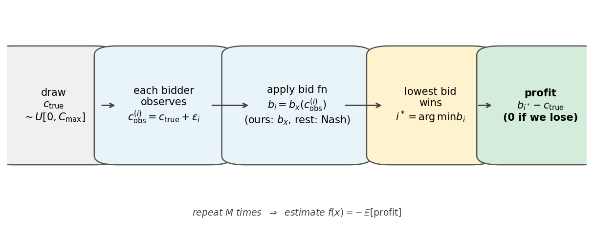

# Learning Auction Bidding Strategies under Value Uncertainty

## Problem

**First-price sealed-bid procurement auction.** The government buys infrastructure; companies submit sealed bids; the **lowest bid wins** at that price. Winner's profit = `bid - c_true`.

- `c_true ~ U[0, 500M]` — true delivery cost, unknown to bidders
- `c_obs = clip(c_true + ε, 0, 500M)`, `ε ~ N(0, σ²)` — each bidder's noisy signal
- Goal: find the **bid function** `c_obs → bid` that maximises expected profit

With noise, no closed-form optimum exists — motivating heuristic search.

## Solution Encoding

Piecewise-linear bid function with `k` equal-width segments, `x ∈ R^(k+1)`:
- `x[0]` — intercept (base markup at signal = 0)
- `x[1..k]` — slope of each segment

Baseline: `k = 4` (5-dimensional search space). Domain: intercept `∈ [0, C_max/N]`, slopes `∈ [0, 1]`.

**Noiseless Nash equilibrium** (`σ = 0`, N bidders):

```
b*(c) = c + (C_max - c) / N
x*    = [C_max/N,  (N-1)/N,  ...,  (N-1)/N]
```

Used as sanity check: at `σ = 0` with all-expert opponents, the heuristic must recover this line.

## Objective Function

`x` encodes bid function `b_x`. The objective:

```
f(x) = - E[ (b_x(c_obs) - c_true) · 1[win] ]
```

Negative expected profit, estimated by Monte Carlo (`M` auctions per evaluation). Minimisation target.



## Opponent Model

Opponents play Nash using their noisy signal; only `σ_i` varies. Four market compositions:

| σ values (in $M) | Scenario |
|---|---|
| `[0, 0, 0]` | All experts — recovers analytical Nash |
| `[50, 50, 50]` | All inexperienced — strong winner's curse |
| `[0, 0, 50]` | Mixed market |
| `[0, 50, 50]` | One expert among noisy competitors |

Agent's own `σ_us` is set separately.
